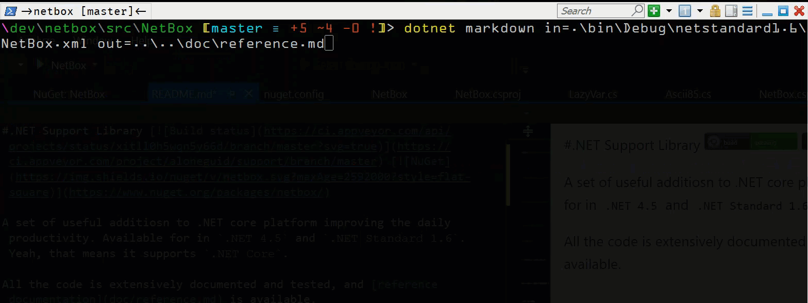
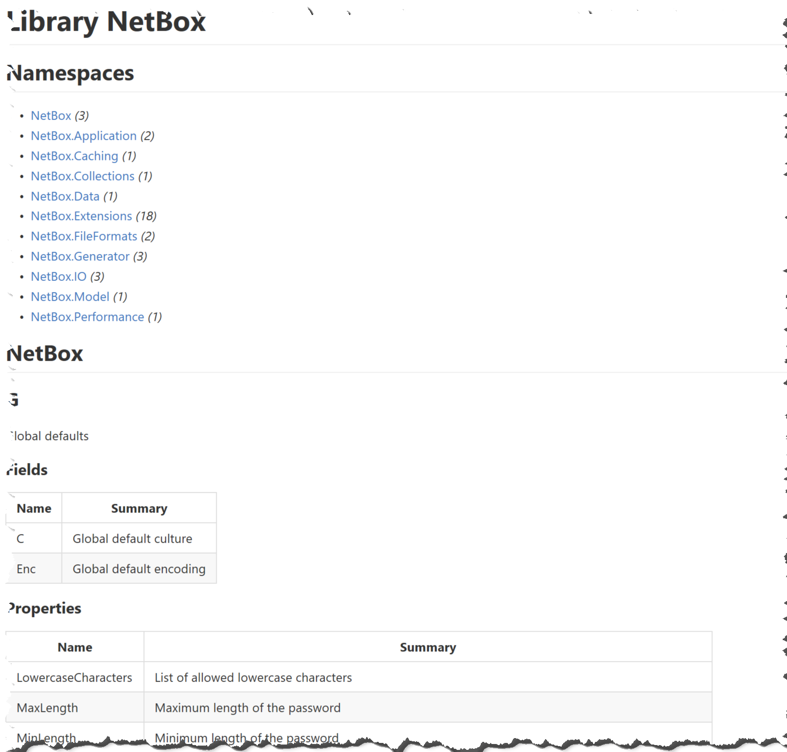

# dotnet markdown CLI tool [](https://www.nuget.org/packages/dotnet-markdown/)

This utility is a command-line extension to the `dotnet` command allowing you to generate a single-page markdown API documentation for a `C#` library.

## Status

More or less usable!

## Adding to the project

In your `.csproj` file add the following section:

```xml
<ItemGroup>
  <DotNetCliToolReference Include="dotnet-markdown" Version="1.0.4" />
</ItemGroup>
```

The version should be whatever latest version of this package is on NuGet i.e. [](https://www.nuget.org/packages/dotnet-markdown/)

## Running

One the reference is added, don't forget to restore the packages for you project, after which you can generate the documentation to a single file by typing

```bash
dotnet markdown in:<path-to-input-xml-file> out:<path-to-output-markdown-file>
```




Generates a really nice documentation page like this




## Sample projects using this tool:

- [NetBox](https://github.com/aloneguid/support/blob/master/doc/reference.md) (a set of helper .NET APIs)
- *add your own...*

### Links

- [Processing XML File](https://docs.microsoft.com/en-us/dotnet/csharp/programming-guide/xmldoc/processing-the-xml-file)